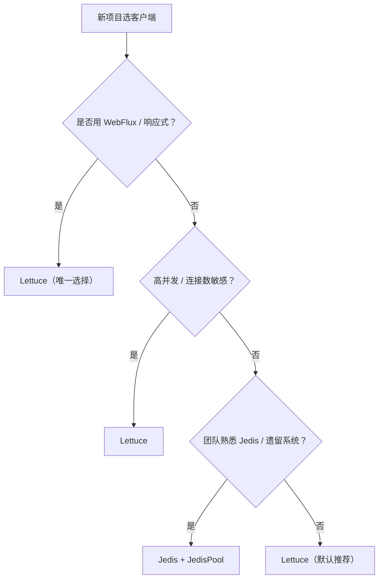

# 第1章 Lettuce vs Jedis

> 主站第二卷讲「Redis 为什么快、数据如何落盘」，本章回答 Spring 生态里一个最实际的问题：连 Redis 的客户端该选 Lettuce 还是 Jedis？二者是 Java 世界最主流的两款 Redis 客户端，选错会直接影响并发能力、内存占用与运维体验。

---

## 1.1 两个客户端的定位

| 客户端 | 底层实现 | 线程模型 | 默认连接方式 |
| :-- | :-- | :-- | :-- |
| Jedis | 直连 Socket，命令同步阻塞 | 多线程，需连接池 | 每个线程独占一个连接 |
| Lettuce | 基于 Netty 异步非阻塞 | 单连接多路复用 | 所有线程共享连接 |

一句话概括：**Jedis 是「一个线程一个连接」的传统模型，Lettuce 是「一个连接服务所有线程」的异步多路复用模型**。这个差异决定了它们在并发场景下的表现天差地别。

---

## 1.2 Spring Boot 的默认选择

Spring Boot 2.x 起，`spring-boot-starter-data-redis` 默认使用 **Lettuce**。原因很直接：

1. **连接数省**：Lettuce 共享连接，线程再多也只需少量连接，不会随并发暴涨；
2. **天然适配响应式**：Lettuce 底层是 Netty，能无缝支持 WebFlux / Reactor；
3. **维护活跃**：Lettuce 更新频繁，对 Redis 新特性支持及时。

> 这是官方替你做的选择。除非有明确理由，**新项目默认用 Lettuce 即可**。

---

## 1.3 核心差异对比

| 维度 | Jedis | Lettuce |
| :-- | :-- | :-- |
| 线程安全 | ❌ 非线程安全，需连接池 | ✅ 连接线程安全，可共享 |
| 连接模型 | 每线程独占连接 | 单连接多路复用 |
| 高并发 | 连接数随线程增长 | 连接数恒定，天然抗高并发 |
| 异步/响应式 | ❌ 不支持 | ✅ 原生支持 |
| 使用简单度 | ✅ API 直观 | 稍复杂（有异步/响应式分支） |
| 集群/哨兵 | ✅ 支持 | ✅ 支持 |
| 连接池 | 必须显式配置 | 可选（默认共享连接） |

---

## 1.4 一个关键误区：Jedis 也要线程安全

新手常误以为「Jedis 简单，直接 new 一个用就行」。实际上 Jedis 实例**非线程安全**，多线程并发用同一个 Jedis 实例会产生数据串扰甚至报错。正确做法是用 **JedisPool**：

```java
// 错误：多线程共用一个 Jedis 实例，会出问题
Jedis jedis = new Jedis("localhost", 6379);
// 多个线程同时 jedis.get(...) → 数据串扰

// 正确：用 JedisPool 池化管理
JedisPool pool = new JedisPool("localhost", 6379);
try (Jedis jedis = pool.getResource()) {   // 从池中借一个连接
    jedis.set("key", "value");
} // 用完归还
```

而 Lettuce 的连接是线程安全的，Spring 里注入的 `StringRedisTemplate` 内部共享同一个 Lettuce 连接，开发者无需关心线程安全问题。

---

## 1.5 选型决策树



**决策结论**：

| 场景 | 推荐 |
| :-- | :-- |
| 新项目、Spring Boot 2.x+ | Lettuce（默认） |
| 响应式（WebFlux） | Lettuce（必选） |
| 高并发、连接数敏感 | Lettuce |
| 遗留系统已用 Jedis | 保持 Jedis，避免迁移成本 |
| 团队更熟 Jedis 且并发不高 | Jedis + JedisPool |

---

## 1.6 本章小结

| 要点 | 说明 |
| :-- | :-- |
| 默认 | Spring Boot 2.x+ 默认 Lettuce |
| 本质差异 | Jedis 每线程独占连接，Lettuce 共享连接多路复用 |
| 线程安全 | Jedis 非线程安全需 JedisPool，Lettuce 天然线程安全 |
| 响应式 | 只有 Lettuce 支持 |
| 结论 | 新项目无脑用 Lettuce，遗留 Jedis 才保留 |

> 记住选型心法：**并发越高越要用 Lettuce，只有「历史包袱」或「团队熟悉度」才让你选择 Jedis**。
