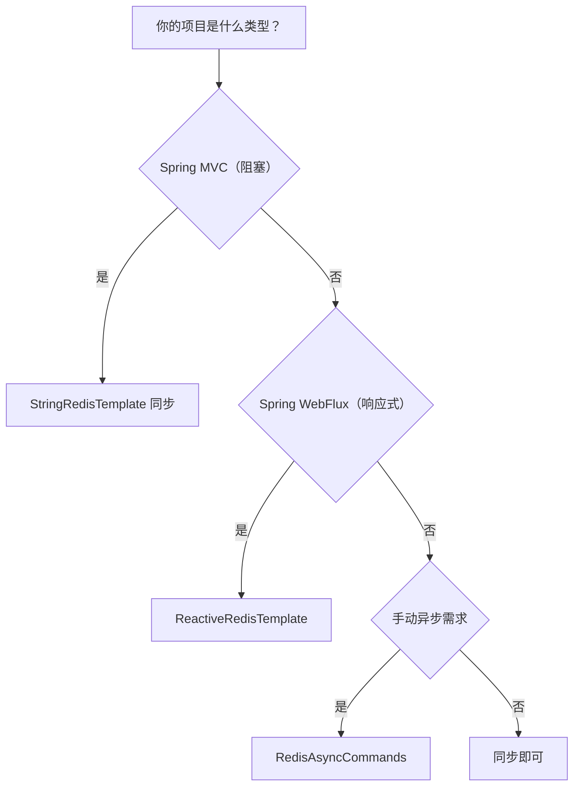

# 第3章 线程模型落地

> 主站第二卷讲 Redis 服务端是单线程 + IO 多路复用，本章把视角切到客户端：在 Spring 里，我们的调用代码是同步还是异步？Lettuce 底层异步非阻塞，那它和 Spring 的响应式（WebFlux / Reactor）如何配合？这决定了你在不同编程模型下该怎么写。

---

## 3.1 先厘清两个「线程模型」

| 层面 | 模型 | 说明 |
| :-- | :-- | :-- |
| Redis 服务端 | 单线程执行命令 + IO 多路复用 | 命令执行串行，靠多路复用扛并发 |
| Java 客户端 | Lettuce 异步非阻塞（Netty） | 客户端内部用少量线程处理大量连接 |

关键理解：**服务端单线程 ≠ 客户端必须同步阻塞**。Lettuce 底层用 Netty 的 EventLoop 异步收发命令，但对外可以暴露成同步、异步、响应式三种 API，分别对应 Spring MVC、异步、WebFlux 三种用法。

---

## 3.2 三种 API 形态

Lettuce 提供了三套接口，Spring Data Redis 也做了对应封装：

| 形态 | 接口 | 适用场景 |
| :-- | :-- | :-- |
| 同步 | `RedisTemplate` / `StringRedisTemplate` | Spring MVC 传统阻塞式 |
| 异步 | `RedisAsyncCommands` | 手动 Future 回调 |
| 响应式 | `ReactiveRedisTemplate` | WebFlux / Reactor |

---

## 3.3 同步调用（最常见）

第一卷全程用的都是同步 API，内部就是「发命令 → 阻塞等结果」：

```java
// 同步：调用线程阻塞等待 Redis 返回
String value = redis.opsForValue().get("key");
```

Spring MVC 的 Tomcat 线程池天然适配同步调用——每个请求占用一个线程，等待 Redis 返回。简单直观，是绝大多数项目的默认选择。

---

## 3.4 响应式调用（WebFlux）

如果项目用 Spring WebFlux（响应式），就不能再用阻塞的 `StringRedisTemplate`（会拖垮 EventLoop），而要换成 `ReactiveRedisTemplate`：

```java
import org.springframework.data.redis.core.ReactiveRedisTemplate;
import org.springframework.data.redis.core.ReactiveStringRedisTemplate;
import org.springframework.stereotype.Service;
import reactor.core.publisher.Mono;

@Service
public class ReactiveDemo {

    private final ReactiveStringRedisTemplate redis;

    public ReactiveDemo(ReactiveStringRedisTemplate redis) {
        this.redis = redis;
    }

    public Mono<String> get(String key) {
        return redis.opsForValue().get(key);   // 返回 Mono，非阻塞
    }

    public Mono<Boolean> set(String key, String value) {
        return redis.opsForValue().set(key, value);
    }
}
```

**关键差异**：

| 对比 | 同步 `StringRedisTemplate` | 响应式 `ReactiveStringRedisTemplate` |
| :-- | :-- | :-- |
| 返回类型 | 直接返回结果 | 返回 `Mono` / `Flux` |
| 阻塞性 | 阻塞调用线程 | 非阻塞，事件驱动 |
| 适用框架 | Spring MVC | Spring WebFlux |

> 规则：**WebFlux 项目必须用 `ReactiveRedisTemplate`，MVC 项目用同步 `StringRedisTemplate`**。二者不可混用——在响应式链路里放一个阻塞调用，等于把 EventLoop 卡死。

---

## 3.5 异步调用（Future）

不引入 WebFlux，但又想非阻塞，可以用 Lettuce 原生的异步接口。Spring 下通过 `RedisConnection` 拿到底层异步命令：

```java
import org.springframework.data.redis.connection.lettuce.LettuceConnectionFactory;
import io.lettuce.core.RedisFuture;
import io.lettuce.core.api.async.RedisAsyncCommands;

// 获取异步命令接口
LettuceConnectionFactory factory = ...;
RedisAsyncCommands<String, String> async =
        (RedisAsyncCommands<String, String>) factory.getConnection().getNativeConnection();

// 异步 set，不阻塞当前线程
RedisFuture<String> future = async.get("key");
future.thenAccept(value -> System.out.println("异步拿到: " + value));
```

> 异步 API 用得较少，因为 Spring 生态已经用响应式（Reactor）统一了非阻塞范式。除非有特殊理由，否则优先用响应式而非裸 Future。

---

## 3.6 三种形态怎么选



**决策结论**：

| 项目类型 | 选择 |
| :-- | :-- |
| 传统 Spring MVC | `StringRedisTemplate`（同步） |
| Spring WebFlux | `ReactiveStringRedisTemplate` |
| 特殊异步需求 | `RedisAsyncCommands`（裸 Future） |

---

## 3.7 本章小结

| 要点 | 说明 |
| :-- | :-- |
| 服务端 vs 客户端 | 服务端单线程，客户端 Lettuce 异步非阻塞 |
| 三种形态 | 同步 / 异步 / 响应式 |
| MVC 用同步 | `StringRedisTemplate`，阻塞调用线程 |
| WebFlux 用响应式 | `ReactiveRedisTemplate`，返回 Mono/Flux |
| 忌混用 | 响应式链路里禁止放阻塞调用 |

> 记住一句话：**框架是什么模型，就选什么形态的 Redis 模板**。MVC 配同步，WebFlux 配响应式，这是 Spring 下最容易被忽略却最重要的选择。
