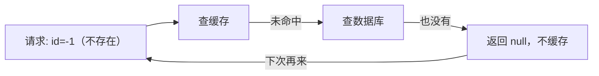
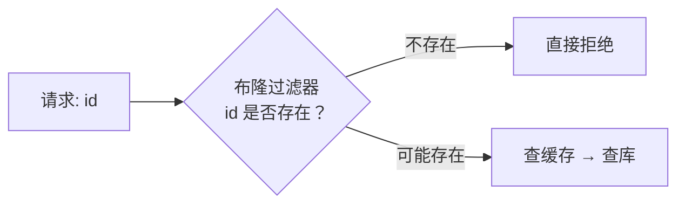

# 第3章 缓存穿透

> 缓存穿透是缓存三大经典问题之首：**查询一个「根本不存在」的数据，缓存和数据库都没有，于是每次请求都穿透缓存直击数据库**。恶意攻击者可以借此打垮数据库。本章讲两种 Java 解法：空值缓存和布隆过滤器。

---

## 3.1 什么是缓存穿透

正常缓存流程：查缓存 → 命中返回；未命中 → 查数据库 → 回填缓存。

穿透问题出在「数据不存在」时：数据库也查不到，无法回填缓存，导致**每次请求都查库**。



> 攻击者只要不断请求不存在的 id，就能让这些请求全部打到数据库，造成数据库压力骤增甚至宕机。

---

## 3.2 方案一：缓存空值（简单）

思路：**数据库查不到时，也缓存一个「空值」**，下次请求直接命中空值，不再穿透到数据库。

```java
@Cacheable(value = "user", key = "#id", unless = "#result == null")
public User getById(Long id) {
    return queryFromDb(id);   // 查不到返回 null
}
```

但上面的 `unless = "#result == null"` 会导致 null 不被缓存，穿透依然存在。要缓存空值，需要**去掉 unless 限制**，并给空值缓存设一个**很短的 TTL**：

```java
// 去掉 unless，让 null 也能被缓存（但需要配合短 TTL）
@Cacheable(value = "user", key = "#id")
public User getById(Long id) {
    return queryFromDb(id);
}
```

配套的 `RedisCacheManager` 配置：为 `user` 缓存空间设短 TTL（如 60 秒），让空值很快过期：

```java
.withCacheConfiguration("user",
        defaultConfig.entryTtl(Duration.ofSeconds(60)))   // 空值 60 秒后过期
```

**空值缓存的优缺点**：

| 优点 | 缺点 |
| :-- | :-- |
| 实现简单，一行注解 | 只能防「单个不存在的 id」 |
| 无需额外组件 | 空值过多会占内存（需短 TTL） |
| 对恶意攻击有效 | 无法防「大量不同不存在 id」 |

> 空值缓存是「治标」手段，适合大多数场景。但如果攻击者用**随机不存在的 id** 轰炸，空值缓存会存满各种垃圾 key，这时需要更强的方案——布隆过滤器。

---

## 3.3 方案二：布隆过滤器（彻底）

布隆过滤器能**提前判断一个 key 是否可能存在**：

- 判断「存在」→ 可能误判（有一定误报率）
- 判断「不存在」→ 一定不存在

利用这个特性：**请求先过布隆过滤器，过滤掉「一定不存在」的 id，从源头拦截穿透**。



---

## 3.4 Redisson 实现布隆过滤器

Redisson 提供了开箱即用的布隆过滤器 `RBloomFilter`：

```xml
<dependency>
    <groupId>org.redisson</groupId>
    <artifactId>redisson-spring-boot-starter</artifactId>
    <version>3.27.0</version>
</dependency>
```

```java
import org.redisson.api.RBloomFilter;
import org.redisson.api.RedissonClient;
import org.springframework.stereotype.Component;

import jakarta.annotation.PostConstruct;

@Component
public class BloomFilterService {

    private final RedissonClient redissonClient;
    private RBloomFilter<Long> bloomFilter;

    public BloomFilterService(RedissonClient redissonClient) {
        this.redissonClient = redissonClient;
    }

    @PostConstruct
    public void init() {
        bloomFilter = redissonClient.getBloomFilter("user:id:bloom");
        // 初始化：预计 100 万元素，误判率 0.01
        bloomFilter.tryInit(1_000_000L, 0.01);
    }

    /** 数据写入时，把 id 加入布隆过滤器 */
    public void add(Long id) {
        bloomFilter.add(id);
    }

    /** 查询前判断 id 是否可能存在 */
    public boolean mightExist(Long id) {
        return bloomFilter.contains(id);
    }
}
```

使用方式：业务查询前先判断：

```java
@Service
public class UserService {

    private final BloomFilterService bloomFilter;
    private final UserDao userDao;

    public UserService(BloomFilterService bloomFilter, UserDao userDao) {
        this.bloomFilter = bloomFilter;
        this.userDao = userDao;
    }

    public User getById(Long id) {
        // 布隆过滤器拦截「一定不存在」的 id
        if (!bloomFilter.mightExist(id)) {
            return null;   // 直接返回，不打数据库
        }
        return userDao.findById(id);   // 可能存在，才查库
    }
}
```

---

## 3.5 两种方案对比与选型

| 维度 | 空值缓存 | 布隆过滤器 |
| :-- | :-- | :-- |
| 实现复杂度 | 低 | 中 |
| 依赖 | 无 | Redisson |
| 内存占用 | 空值越多越占 | 固定（与数据量成正比） |
| 防随机攻击 | 弱 | 强 |
| 误判 | 无 | 有（可调误报率） |
| 数据一致性 | 空值过期即消失 | 数据删除后需同步移除 |

**选型建议**：

| 场景 | 推荐 |
| :-- | :-- |
| 一般业务、空值不多 | 空值缓存（简单够用） |
| 防恶意随机攻击 | 布隆过滤器 |
| 超大规模数据（亿级） | 布隆过滤器（内存优势明显） |

> 生产常用组合：**布隆过滤器拦截 + 空值缓存兜底**。布隆过滤掉绝大多数「一定不存在」的请求，空值缓存再兜住少量误判情况。

---

## 3.6 本章小结

| 要点 | 说明 |
| :-- | :-- |
| 穿透本质 | 查不存在的数据，缓存兜不住，每次直击数据库 |
| 方案一 | 空值缓存：查不到也缓存 null，配短 TTL |
| 方案二 | 布隆过滤器：提前拦截「一定不存在」的 id |
| 实现 | Redisson `RBloomFilter`，`tryInit` + `add` + `contains` |
| 选型 | 简单用空值缓存，防攻击用布隆过滤器，可组合 |

> 穿透的核心矛盾是「缓存里没有，数据库里也没有」。空值缓存是「事后补救」，布隆过滤器是「事前拦截」，二者结合效果最佳。
