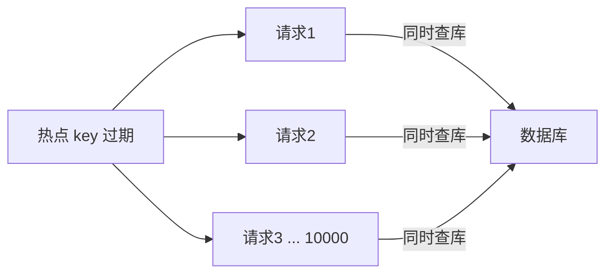

# 第4章 缓存击穿

> 缓存击穿和穿透一字之差，问题完全不同：穿透是「数据根本不存在」，击穿是「数据存在，但缓存刚好过期」。热点 key 过期瞬间，海量请求同时打到数据库，可能瞬间压垮它。本章讲两种 Java 解法：互斥锁和逻辑过期。

---

## 4.1 什么是缓存击穿

某个**热点数据**（如爆款商品、明星热搜）缓存过期的那一刻，大量并发请求同时发现缓存失效，**一起涌向数据库**。



> 击穿的关键特征是「**同一时刻、同一个 key、大量并发**」。和雪崩（大量不同 key 同时过期）的区别就在这里——击穿是单点，雪崩是全面。

---

## 4.2 方案一：互斥锁（重建时加锁）

核心思想：**缓存失效后，只允许一个请求去查数据库重建缓存，其他请求等待（或返回旧值）**。

```java
import org.springframework.data.redis.core.StringRedisTemplate;
import org.springframework.stereotype.Service;

import java.time.Duration;
import java.util.concurrent.TimeUnit;

@Service
public class CacheBreakdownService {

    private final StringRedisTemplate redis;
    private final UserDao userDao;

    public CacheBreakdownService(StringRedisTemplate redis, UserDao userDao) {
        this.redis = redis;
        this.userDao = userDao;
    }

    public User getByIdWithLock(Long id) {
        String key = "user:" + id;
        String lockKey = "lock:user:" + id;

        // 1. 先查缓存
        String cached = redis.opsForValue().get(key);
        if (cached != null) {
            return toUser(cached);
        }

        // 2. 缓存失效，尝试加锁（只让一个请求去重建）
        boolean locked = Boolean.TRUE.equals(
                redis.opsForValue().setIfAbsent(lockKey, "1", Duration.ofSeconds(10)));

        if (locked) {
            try {
                // 双重检查：可能其他线程已重建
                cached = redis.opsForValue().get(key);
                if (cached != null) {
                    return toUser(cached);
                }
                // 查库重建缓存
                User user = userDao.findById(id);
                if (user != null) {
                    redis.opsForValue().set(key, toJson(user), Duration.ofMinutes(30));
                }
                return user;
            } finally {
                redis.delete(lockKey);   // 释放锁
            }
        } else {
            // 3. 没抢到锁，稍等重试（或返回旧值）
            try {
                TimeUnit.MILLISECONDS.sleep(50);
            } catch (InterruptedException e) {
                Thread.currentThread().interrupt();
            }
            return getByIdWithLock(id);   // 递归重试
        }
    }
}
```

> 这个手动实现演示了「互斥锁」的原理。生产环境更推荐用 **Redisson 的 `RLock`**（第四卷会详细讲），它封装了看门狗续期、可重入等能力。

---

## 4.3 方案二：逻辑过期（不设 TTL，异步重建）

互斥锁的问题是「重建期间其他请求要等待」。逻辑过期的思路更优雅：**缓存不设物理 TTL，而是存一个「逻辑过期时间」字段；读取时发现逻辑过期，先返回旧值，再异步重建**。

```java
public User getByIdWithLogicalExpire(Long id) {
    String key = "user:" + id;
    String lockKey = "lock:user:" + id;

    // 1. 查缓存（value 是带逻辑过期时间的 JSON）
    String cached = redis.opsForValue().get(key);
    if (cached == null) {
        return null;
    }

    CacheData data = parse(cached);   // {user, expireAt}
    if (data.expireAt > System.currentTimeMillis()) {
        return data.user;              // 未逻辑过期，直接返回
    }

    // 2. 已逻辑过期：先返回旧值，再异步重建
    boolean locked = redis.opsForValue()
            .setIfAbsent(lockKey, "1", Duration.ofSeconds(10));
    if (locked) {
        // 异步重建缓存（不阻塞当前请求）
        executor.submit(() -> {
            User user = userDao.findById(id);
            if (user != null) {
                redis.opsForValue().set(key, toJsonWithExpire(user, 30));
            }
            redis.delete(lockKey);
        });
    }
    return data.user;   // 返回旧值，用户无感知
}
```

**两种方案对比**：

| 维度 | 互斥锁 | 逻辑过期 |
| :-- | :-- | :-- |
| 一致性 | 强（重建后返回新值） | 弱（先返回旧值） |
| 用户体验 | 重建期间可能等待 | 无等待，秒回旧值 |
| 实现复杂度 | 中 | 中高（需额外字段 + 异步线程池） |
| 适用场景 | 一致性要求高 | 可用性要求高、容忍短暂旧数据 |

---

## 4.4 Spring Cache 注解下的击穿处理

`@Cacheable` 注解本身**不能防击穿**——缓存过期后，所有并发请求都会穿透注解进入方法体。要防击穿，需结合 `sync` 属性（Spring 4.3+ 提供）：

```java
@Cacheable(value = "user", key = "#id", sync = true)
public User getById(Long id) {
    return queryFromDb(id);
}
```

`sync = true` 会让 Spring 在缓存未命中时**对同一个 key 的并发请求加锁**，只允许一个线程查库，其他线程等待结果。这是最省事的防击穿方式，但注意：

1. `sync` 只支持 `@Cacheable`，不支持 `@CachePut` / `@CacheEvict`；
2. 锁粒度由缓存实现决定，Redis 下基于 key 级别；
3. 复杂场景（逻辑过期）仍需手动实现。

---

## 4.5 本章小结

| 要点 | 说明 |
| :-- | :-- |
| 击穿本质 | 热点 key 过期瞬间，海量并发同时查库 |
| 互斥锁 | 只让一个请求重建，其他等待或返回旧值 |
| 逻辑过期 | 不设物理 TTL，先返回旧值再异步重建 |
| 注解方案 | `@Cacheable(sync = true)` 最省事 |
| 选型 | 强一致用互斥锁，高可用用逻辑过期 |

> 击穿和穿透的关键区分：**穿透是「查不到」，击穿是「查得到但缓存刚好过期」**。穿透靠布隆/空值缓存，击穿靠加锁/逻辑过期，对症下药。
