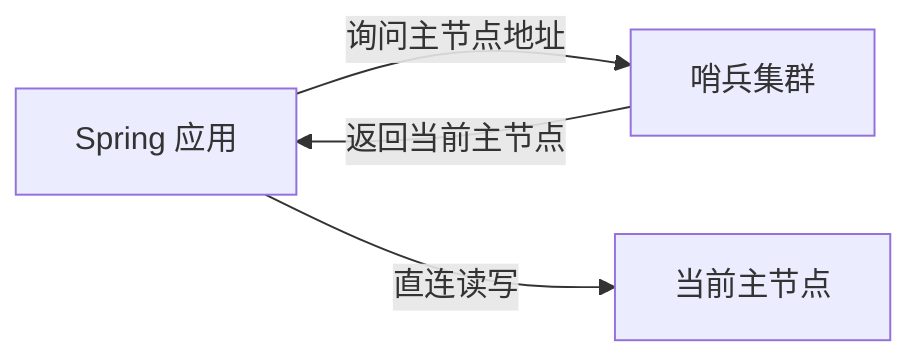

# 第3章 主从 / 哨兵接入

> 主站第四卷讲了主从复制、哨兵模式的原理，本章落到 Spring 配置：如何让 Spring 应用连上「哨兵监控的主从架构」，并理解哨兵解决了什么问题、应用侧要配什么。

---

## 3.1 先回顾哨兵解决了什么

单机 Redis 没有高可用，宕机即不可用。哨兵（Sentinel）机制解决三件事：

| 能力 | 说明 |
| :-- | :-- |
| 监控 | 持续检测主从节点是否存活 |
| 自动故障转移 | 主节点宕机，自动从从节点中选出新主 |
| 通知 | 故障转移后通知客户端（应用侧） |

对应用来说，最关键的体验是：**主节点挂了，哨兵自动切换，应用几乎无感知地继续读写新主节点**。

---

## 3.2 Spring Boot 哨兵配置

Spring Boot 下，通过 `spring.data.redis.sentinel.*` 配置哨兵模式：

```yaml
spring:
  data:
    redis:
      sentinel:
        master: mymaster           # 哨兵监控的主节点名称
        nodes:
          - 192.168.1.10:26379     # 哨兵节点1
          - 192.168.1.11:26379     # 哨兵节点2
          - 192.168.1.12:26379     # 哨兵节点3
      password: yourpassword       # Redis 密码（如有）
      timeout: 3s
      lettuce:
        pool:
          max-active: 16
          max-idle: 8
```

**关键点**：

1. **`master` 名称必须和哨兵配置里的一致**：`sentinel monitor mymaster ...` 里的 `mymaster` 就是这里要填的；
2. **`nodes` 填哨兵地址，不是 Redis 主从地址**：端口默认 26379；
3. **哨兵至少 3 个**：哨兵本身也要高可用，避免单点误判。

---

## 3.3 应用侧发生了什么

配置哨兵后，Lettuce 的 `LettuceConnectionFactory` 会：



1. 应用启动时，向哨兵询问「当前主节点是谁」；
2. 拿到主节点地址后，直接连接主节点读写；
3. 主节点故障时，哨兵完成切换后**通知应用**，应用重新连接到新主节点。

> 这个过程对业务代码是透明的——你依然用 `StringRedisTemplate`，不需要改任何代码。

---

## 3.4 Redisson 的哨兵配置

如果用 Redisson（分布式锁等），哨兵配置稍有不同，需要手动定义 `RedissonClient`：

```java
import org.redisson.Redisson;
import org.redisson.api.RedissonClient;
import org.redisson.config.Config;
import org.springframework.context.annotation.Bean;
import org.springframework.context.annotation.Configuration;

@Configuration
public class RedissonConfig {

    @Bean
    public RedissonClient redissonClient() {
        Config config = new Config();
        config.useSentinelServers()
                .setMasterName("mymaster")
                .addSentinelAddress("redis://192.168.1.10:26379",
                                    "redis://192.168.1.11:26379",
                                    "redis://192.168.1.12:26379")
                .setPassword("yourpassword");
        return Redisson.create(config);
    }
}
```

---

## 3.5 主从下的读写分离

主从架构下，主节点负责写，从节点负责读，可以减轻主节点压力。但**读写分离有一个致命问题：主从复制是异步的，从节点可能读到旧数据**。

| 读策略 | 优点 | 缺点 |
| :-- | :-- | :-- |
| 只读主节点 | 数据最新 | 主节点压力大 |
| 读从节点 | 减轻主压力 | 可能读到旧数据 |

> **强一致需求的场景，不要用从节点读**。只有「允许短暂不一致」的查询（如排行榜、展示类数据）才适合读写分离。

---

## 3.6 哨兵 vs 集群怎么选

| 维度 | 哨兵（主从+哨兵） | 集群（Cluster） |
| :-- | :-- | :-- |
| 数据分片 | ❌ 不分片，全量数据 | ✅ 分片存储 |
| 高可用 | ✅ 自动故障转移 | ✅ 自动故障转移 |
| 容量扩展 | 受单机内存限制 | 横向扩容 |
| 复杂度 | 低 | 高 |
| 适用 | 数据量不大、单机够存 | 数据量大、需分片 |

> 简单判断：**数据量单机能装下 → 哨兵够用；数据量大到单机装不下 → 集群**。多数中小项目用哨兵即可。

---

## 3.7 本章小结

| 要点 | 说明 |
| :-- | :-- |
| 哨兵作用 | 监控 + 自动故障转移 + 通知 |
| Spring 配置 | `spring.data.redis.sentinel.master` + `nodes` |
| 关键点 | master 名称一致、nodes 填哨兵地址、至少 3 个哨兵 |
| Redisson | 手动 `Config.useSentinelServers()` |
| 读写分离 | 从节点读有旧数据风险，强一致别用 |

> 哨兵接入的本质：**应用不直连固定 IP，而是通过哨兵动态发现主节点**。这样主节点变了，应用也能自动跟上。
