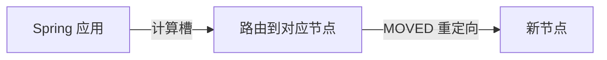

# 第4章 集群接入

> 主站第四卷讲了 Redis Cluster 的分片原理（16384 个槽、MOVED/ASK 重定向、哈希标签），本章落到 Spring：如何连上集群，以及集群模式下最需要注意的「跨槽限制」怎么规避。

---

## 4.1 Redis Cluster 解决了什么

哨兵解决了「高可用」，但没解决「容量」——数据量大到单机装不下时，就需要**分片**。Redis Cluster 把数据分散到多个节点：

| 能力 | 说明 |
| :-- | :-- |
| 数据分片 | 16384 个哈希槽分布到多个节点 |
| 高可用 | 每个主节点配从节点，主宕机自动切换 |
| 横向扩容 | 加节点即可扩展容量 |

---

## 4.2 Spring Boot 集群配置

Spring Boot 下，通过 `spring.data.redis.cluster.nodes` 配置集群：

```yaml
spring:
  data:
    redis:
      cluster:
        nodes:
          - 192.168.1.10:6379
          - 192.168.1.11:6379
          - 192.168.1.12:6379
      password: yourpassword
      timeout: 3s
      lettuce:
        pool:
          max-active: 16
          max-idle: 8
```

**关键点**：

1. **`nodes` 填集群任意节点即可**：客户端会自动发现集群拓扑，但建议填全部主节点，避免填的那个正好宕机；
2. **只需填主节点**：客户端会自动获取从节点信息；
3. **业务代码无感知**：依然用 `StringRedisTemplate`，Lettuce 自动处理分片路由。

---

## 4.3 客户端如何路由

集群模式下，客户端根据 key 计算它属于哪个槽，再路由到对应节点：

```text
key "user:1" → CRC16(key) % 16384 → 槽 1234 → 节点 A
key "user:2" → CRC16(key) % 16384 → 槽 5678 → 节点 B
```

Lettuce 内置了槽计算和 MOVED/ASK 重定向处理，开发者无需关心：



> 集群模式下，**每个 key 被独立路由到不同节点**。这是理解「跨槽限制」的前提。

---

## 4.4 跨槽限制：集群模式最大的坑

这是集群模式下最容易踩的坑。**涉及多个 key 的命令，要求这些 key 必须在同一个槽（同一个节点）上**，否则报错：

```text
CROSSSLOT Keys in request don't hash to the same slot
```

会触发跨槽错误的典型场景：

| 操作 | 问题 |
| :-- | :-- |
| `MGET user:1 user:2` | 多个 key 可能在不同槽 |
| `MSET` / `SINTER` 等多 key 命令 | 同上 |
| 事务 `MULTI/EXEC` 多 key | 同上 |
| Lua 脚本访问多 key | 同上 |

**解法：哈希标签（Hash Tag）**

用 `{}` 包裹 key 的一部分，让 Redis 只用 `{}` 内的部分计算槽：

```text
user:{1}:name  → 只对 "1" 计算槽
user:{1}:age   → 只对 "1" 计算槽
```

这样 `user:{1}:name` 和 `user:{1}:age` 就会落到同一个槽，可以一起用多 key 命令：

```java
// 通过哈希标签，让相关 key 落到同一槽
String key1 = "user:{1}:name";
String key2 = "user:{1}:age";

// 现在可以安全使用 MGET
List<String> values = redis.opsForValue().multiGet(List.of(key1, key2));
```

> 哈希标签的代价：如果滥用（如所有 key 都用 `{固定值}`），会导致数据倾斜，全部集中到一个节点，失去分片意义。**哈希标签只用于「确实需要一起操作」的 key 组**。

---

## 4.5 Redisson 的集群配置

Redisson 的集群配置：

```java
import org.redisson.Redisson;
import org.redisson.api.RedissonClient;
import org.redisson.config.Config;
import org.springframework.context.annotation.Bean;
import org.springframework.context.annotation.Configuration;

@Configuration
public class RedissonConfig {

    @Bean
    public RedissonClient redissonClient() {
        Config config = new Config();
        config.useClusterServers()
                .addNodeAddress("redis://192.168.1.10:6379",
                                "redis://192.168.1.11:6379",
                                "redis://192.168.1.12:6379")
                .setPassword("yourpassword");
        return Redisson.create(config);
    }
}
```

---

## 4.6 集群 vs 哨兵决策回顾

| 维度 | 哨兵 | 集群 |
| :-- | :-- | :-- |
| 数据分片 | ❌ | ✅ |
| 容量上限 | 单机内存 | 多机总和 |
| 多 key 操作 | 无限制 | 受跨槽限制 |
| 运维复杂度 | 低 | 高 |
| 适用 | 中小数据量 | 大数据量 |

---

## 4.7 本章小结

| 要点 | 说明 |
| :-- | :-- |
| 集群作用 | 分片 + 高可用 + 横向扩容 |
| Spring 配置 | `spring.data.redis.cluster.nodes` |
| 路由原理 | CRC16(key) % 16384 定位槽 |
| 跨槽限制 | 多 key 命令要求同槽，用哈希标签 `{}` 解决 |
| 哈希标签代价 | 滥用会导致数据倾斜 |

> 集群模式的精髓就一句：**数据被切到 16384 个槽，key 按槽路由**。记住这句话，「跨槽限制」和「哈希标签」就都好理解了。
