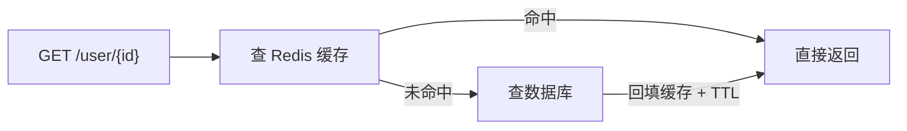

# 第2章 缓存接口

> 场景一：实现一个「用户信息查询」接口，用 Cache-Aside 模式缓存到 Redis，缓解数据库压力。这是最经典的缓存落地场景，也是第三卷第 5 章「缓存一致性」的具体实现。

---

## 2.1 业务背景

一个用户信息查询接口，被高频调用。如果每次都查数据库，数据库压力很大。我们用 Redis 缓存查询结果：



---

## 2.2 实体类

```java
package com.example.redispractice.model;

public class User {
    private Long id;
    private String name;
    private Integer age;
    private String email;

    // 无参构造（JSON 反序列化必需）
    public User() {}

    public User(Long id, String name, Integer age, String email) {
        this.id = id;
        this.name = name;
        this.age = age;
        this.email = email;
    }

    // getter / setter 省略
}
```

---

## 2.3 模拟数据库层

为聚焦缓存逻辑，这里用内存 Map 模拟数据库，并人为加 50ms 延迟模拟真实查询耗时：

```java
package com.example.redispractice.service;

import com.example.redispractice.model.User;
import org.springframework.stereotype.Component;

import java.util.Map;
import java.util.concurrent.ConcurrentHashMap;

@Component
public class UserDao {

    private final Map<Long, User> db = new ConcurrentHashMap<>();

    public UserDao() {
        // 模拟数据库初始数据
        db.put(1L, new User(1L, "张三", 25, "zhangsan@qq.com"));
        db.put(2L, new User(2L, "李四", 30, "lisi@qq.com"));
    }

    /** 模拟数据库查询，耗时 50ms */
    public User findById(Long id) {
        try {
            Thread.sleep(50);
        } catch (InterruptedException e) {
            Thread.currentThread().interrupt();
        }
        return db.get(id);
    }

    public void update(User user) {
        db.put(user.getId(), user);
    }
}
```

---

## 2.4 缓存服务（Cache-Aside）

核心实现：**先查缓存，未命中查库，回填缓存**。

```java
package com.example.redispractice.service;

import com.example.redispractice.model.User;
import com.fasterxml.jackson.databind.ObjectMapper;
import org.springframework.data.redis.core.StringRedisTemplate;
import org.springframework.stereotype.Service;

import java.time.Duration;

@Service
public class UserService {

    private static final String KEY_PREFIX = "user:";
    private static final Duration CACHE_TTL = Duration.ofMinutes(5);

    private final StringRedisTemplate redis;
    private final UserDao userDao;
    private final ObjectMapper objectMapper;

    public UserService(StringRedisTemplate redis, UserDao userDao, ObjectMapper objectMapper) {
        this.redis = redis;
        this.userDao = userDao;
        this.objectMapper = objectMapper;
    }

    public User getById(Long id) {
        String key = KEY_PREFIX + id;

        // 1. 先查缓存
        String cached = redis.opsForValue().get(key);
        if (cached != null) {
            return parse(cached);   // 命中，直接返回
        }

        // 2. 未命中，查数据库
        User user = userDao.findById(id);
        if (user == null) {
            return null;
        }

        // 3. 回填缓存 + TTL
        redis.opsForValue().set(key, toJson(user), CACHE_TTL);
        return user;
    }

    /** 更新：先写库，再删缓存（Cache-Aside 写路径） */
    public void update(User user) {
        userDao.update(user);                    // 1. 先更新数据库
        redis.delete(KEY_PREFIX + user.getId()); // 2. 再删除缓存
    }

    private String toJson(User user) {
        try {
            return objectMapper.writeValueAsString(user);
        } catch (Exception e) {
            throw new RuntimeException("序列化失败", e);
        }
    }

    private User parse(String json) {
        try {
            return objectMapper.readValue(json, User.class);
        } catch (Exception e) {
            throw new RuntimeException("反序列化失败", e);
        }
    }
}
```

---

## 2.5 Controller 层

```java
package com.example.redispractice.controller;

import com.example.redispractice.model.User;
import com.example.redispractice.service.UserService;
import org.springframework.web.bind.annotation.*;

@RestController
@RequestMapping("/user")
public class UserController {

    private final UserService userService;

    public UserController(UserService userService) {
        this.userService = userService;
    }

    @GetMapping("/{id}")
    public User getById(@PathVariable Long id) {
        return userService.getById(id);
    }

    @PutMapping
    public String update(@RequestBody User user) {
        userService.update(user);
        return "ok";
    }
}
```

---

## 2.6 关键点：Cache-Aside 的两个顺序

| 操作 | 正确顺序 | 错误顺序的后果 |
| :-- | :-- | :-- |
| 读 | 先缓存 → 未命中查库 → 回填 | 反之每次查库，缓存失效 |
| 写 | 先写库 → 再删缓存 | 先删缓存再写库，并发读会把旧值写回缓存 |

> 为什么写路径是「删缓存」而不是「更新缓存」？因为更新缓存可能写入并发下的旧值；而删缓存后由下次读请求重新回填，天然避免并发写脏数据。详见第三卷第 5 章。

---

## 2.7 验证

启动项目后：

```bash
# 第一次请求：回源数据库（约 50ms）
curl http://localhost:8080/user/1

# 第二次请求：命中缓存（<1ms）
curl http://localhost:8080/user/1
```

查看 Redis 中的缓存：

```bash
redis-cli GET "user:1"      # 应看到 JSON
redis-cli TTL "user:1"      # 应返回剩余过期时间（约 300 秒）
```

---

## 2.8 本章小结

| 要点 | 说明 |
| :-- | :-- |
| 读路径 | 先缓存 → 查库 → 回填 |
| 写路径 | 先写库 → 删缓存 |
| 序列化 | StringRedisTemplate + Jackson 手动转换 |
| TTL | 5 分钟，防止缓存永久堆积 |

> 缓存接口是全书最基础的落地场景，但它串联了「序列化选型（第一卷）、Cache-Aside（第三卷）」两个关键知识点。搞懂这一个，其他缓存场景都能举一反三。
